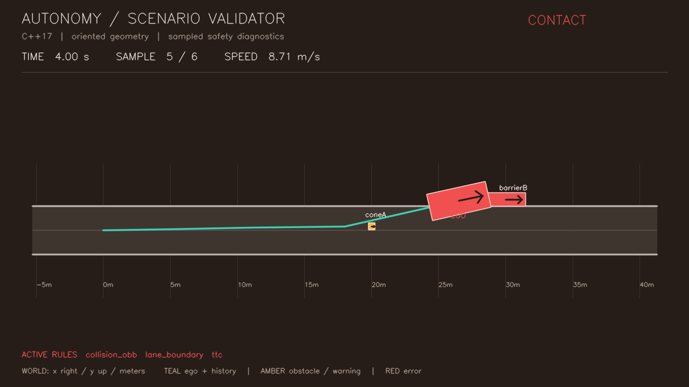
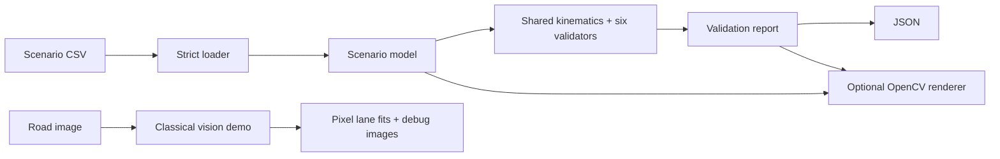
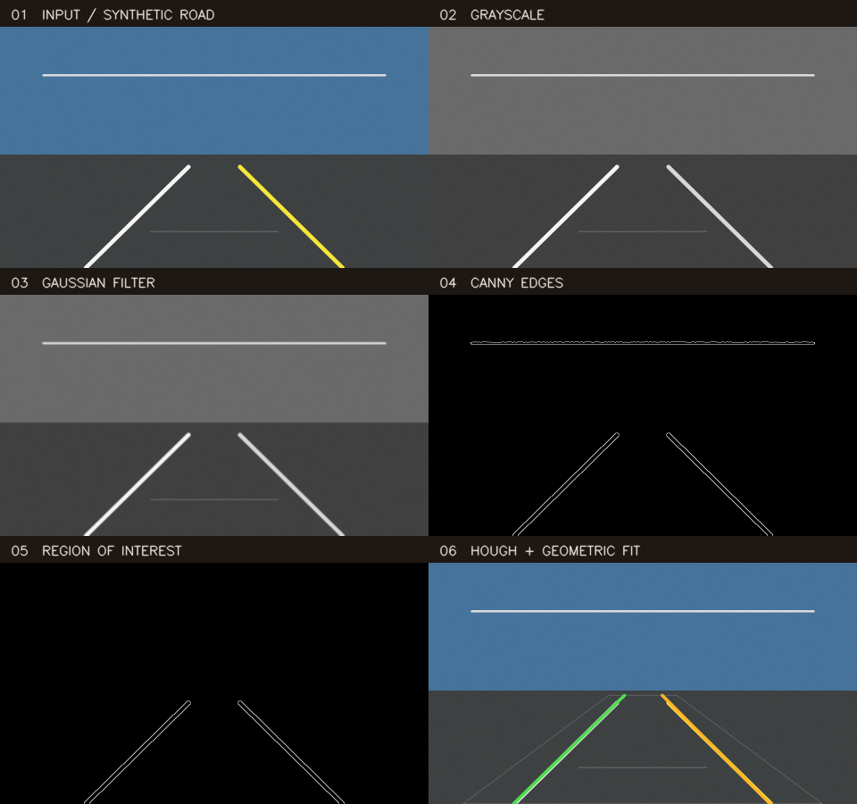

# Autonomy Scenario Validator

**C++17 autonomy scenario playback and safety validation with OpenCV visualization and a classical computer vision pipeline.**


[](https://github.com/Abdullah-Raashid/autonomy-scenario-validator/actions/workflows/ci.yml)



- Six modular safety validators, dynamic obstacles and deterministic JSON reports.
- Optional headless OpenCV playback and explicit image-processing stages.
- CMake targets, GoogleTest/CTest, sanitizer options and Linux CI.

```sh
cmake -S . -B build -DCMAKE_BUILD_TYPE=Release && cmake --build build -j4
./build/scenario_playback --traj data/sample_trajectory.csv \
  --obs data/sample_obstacles.csv --out build/report.json
```

## What it demonstrates

Modern C++ ownership and interfaces, autonomous-driving validation geometry,
classical image processing, numerical boundary tests and measured algorithm
performance. The screenshot is generated by the C++ renderer from the checked-in
scenario; its contacts and lane departures are intentional.

## Features

| Component | Working implementation |
|---|---|
| Input and reporting | Strict CSV schemas, finite numbers, timestamp checks, transactional loading; schema-v2 JSON |
| Safety rules | Speed, vector acceleration, jerk, body lane margin, OBB collision/clearance, predictive TTC |
| Scenario playback | Explicit/inferred ego heading; static and constant-velocity obstacles |
| Computer vision | Gaussian smoothing, Canny, ROI, Hough candidates, geometric filtering and weighted fitting |

## Quick start

Run from the repository root. Requires **CMake >=3.20** and a **C++17 compiler**.
Tests fetch GoogleTest 1.17.0 from a pinned, SHA-256-verified archive.

**Core — OpenCV is not required:**

```sh
cmake -S . -B build -DCMAKE_BUILD_TYPE=Release
cmake --build build -j4
ctest --test-dir build --output-on-failure
./build/scenario_playback --traj data/sample_trajectory.csv \
  --obs data/sample_obstacles.csv --out build/report.json
```

Omit `--obs` for no obstacles. `--help` lists thresholds. Exit codes: `0` completed,
`2` input/output error, and `3` when `--fail-on-violation` is selected and a rule
fires. A failing scenario still produces its report.

**OpenCV-enabled — install OpenCV 4 development libraries first:**

```sh
cmake -S . -B build-opencv -DCMAKE_BUILD_TYPE=Release -DASV_WITH_OPENCV=ON
cmake --build build-opencv -j4
ctest --test-dir build-opencv --output-on-failure
./build-opencv/scenario_visualize --traj data/sample_trajectory.csv \
  --obs data/sample_obstacles.csv --frames outputs/sample
./build-opencv/lane_detection_demo --input data/synthetic_road.png --output outputs/lanes
```

No display server is needed. Use `-DOpenCV_DIR=/path/to/lib/cmake/opencv4` if CMake
cannot find your installation. The actual option is **`ASV_WITH_OPENCV`**.
Offline core builds can set `-DBUILD_TESTING=OFF`; offline tests can provide
`-DFETCHCONTENT_SOURCE_DIR_GOOGLETEST=/path/to/googletest-1.17.0`.

## Example output

A small excerpt of the real sample report, with unshown fields omitted:

```json
{
  "scenario": {"trajectory_file": "data/sample_trajectory.csv", "sample_count": 6},
  "summary": {
    "result": "FAIL",
    "total_violations": 7,
    "counts_by_rule": {"collision_obb": 2, "lane_boundary": 2, "ttc": 3}
  },
  "violations": [
    {"t": 4, "sample_index": 4, "rule": "lane_boundary", "severity": "error",
     "details": "vehicle footprint crosses lane boundary"}
  ]
}
```

The sample command reproduces the complete [JSON output](docs/sample-report.json),
including parameters and metrics. Unavailable measurements are `null`.

## Architecture



`asv::core` owns the validation library. Add an `IValidator::Evaluate` implementation
with `unique_ptr` ownership; loading and report serialization stay independent.
The optional vision library contains rendering and pixel-space lane detection.

## Validation algorithms

- **Kinematics:** segment velocities; vector acceleration and jerk at derivative
  midpoint times, including nonuniform timestamp spacing.
- **Collision:** SAT on both rectangles' local axes; heading rotates their extents.
  Touching counts as contact, with no artificial tolerance or inflation.
- **Clearance/lane:** minimum Euclidean rectangle distance and signed full-body
  corridor margin. The AABB implementation remains a reference baseline.
- **TTC:** intersect swept SAT contact intervals under constant velocity and fixed
  heading. This is a prediction, not a physics simulator.

Coordinates are meters, seconds and radians; +x is forward and +y left. Moving
obstacles start at their CSV pose at the trajectory's first timestamp.
[Mathematics, defaults and CSV contracts](docs/ALGORITHMS.md).

## Computer vision demo



**Classical Vision Lane Detection Demo:** grayscale -> Gaussian smoothing ->
Canny -> trapezoidal ROI -> Hough segments -> geometric filtering/weighted fitting
-> overlay. The tool exports every stage and a combined panel.

The checked-in image is generated with known straight-line geometry, mild seeded
noise and distractors. Synthetic tests check coordinate tolerance, absent lanes,
ROI behavior and repeatability. Lane estimates remain in image pixels: there is
no calibrated camera-to-world transformation or claimed real-road accuracy.
This is a demonstration classical vision pipeline, not production ADAS perception.

## Testing and reliability

CTest names expose `CsvInput`, `Numeric`, `Kinematics`, `Validators`, `Geometry`,
`Engine`, `Report`, `SyntheticVision`, `VisionInput`, `Renderer` and CLI integration.
Coverage includes malformed input, nonuniform derivatives, threshold equality,
rotated contacts/near misses, moving obstacles, analytic TTC, JSON escaping and
PNG round trips. Renderer regressions cover extreme viewports and bounded grid work.

```sh
cmake -S . -B build-sanitize -DCMAKE_BUILD_TYPE=Debug \
  -DASV_ENABLE_SANITIZERS=ON -DASV_WARNINGS_AS_ERRORS=ON
cmake --build build-sanitize -j4
ctest --test-dir build-sanitize --output-on-failure
```

Linux CI runs GCC Release, Clang ASan/UBSan, OpenCV and clang-format 18 checks.
[Actual verification results](docs/VERIFICATION.md) and
[contributing instructions](CONTRIBUTING.md) distinguish passes from codec skips.

## Performance

Measured on an **Apple M2 MacBook Air, 8 GB RAM**, **Release** build, one warmup and
**five timed runs** per workload:

| Workload | Samples | Obstacles | Median | Throughput |
|---|---:|---:|---:|---:|
| Clear | 10,000 | 20 | 34.19 ms | 292,482 samples/s |
| Clear | 100,000 | 20 | 345.70 ms | 289,269 samples/s |
| Overlapping | 10,000 | 8 | 8.17 ms | 1,224,715 samples/s |

Includes input invariant checks, shared kinematics, six validators and report
allocations. Excludes scenario generation, CSV I/O, JSON serialization, report
destruction and visualization. The overlapping workload has fewer obstacles and
short-circuits distance work; its throughput is not a same-workload speedup.
These local measurements do not establish real-time perception performance.

```sh
./build/asv_benchmark --samples 10000 --obstacles 20 --repeats 5
./build/asv_benchmark --samples 100000 --obstacles 20 --repeats 5
./build/asv_benchmark --samples 10000 --obstacles 8 --repeats 5 --stress
```

[Environment and methodology](docs/PERFORMANCE.md) · [Raw measurements](docs/benchmark-results.csv)

## Project structure

```text
apps/        validation, playback and vision CLIs
include/     public core, model, I/O, geometry, validator and vision APIs
src/         implementation of those layers
tests/       GoogleTest suites and CLI integration checks
benchmarks/  deterministic synthetic validation workload
data/        CSV scenarios and generated road fixture
docs/        mathematics, evidence, screenshots and interview notes
.github/     Linux CI
```

## Design decisions

Explicit ownership, a borrowed read-only scenario context and shared kinematics
keep rules extensible without adding an unnecessary framework. Optional values
represent unavailable estimates; stable ordering and locale-independent JSON make
reports reproducible on the same build. OpenCV stays outside the core. Build trees
and temporary outputs are ignored; small intentional presentation assets are tracked.

## Limitations / non-goals

Sampled collision can miss contact between timestamps. TTC assumes constant
translation/fixed yaw; lanes are straight and derivatives unsmoothed. No sensor
uncertainty, planner, controller or safety certification is modeled. Vision testing
is synthetic and does not cover curved roads, severe occlusion or arbitrary cameras.
Obstacle checks remain O(N*M), with O(K) report memory for K violations.
MP4 export depends on installed codecs; PNG export is the portable path. Video
uses fixed FPS per sample, so irregular scenario timing is not preserved.

## Documentation

- [Algorithms and coordinate contracts](docs/ALGORITHMS.md)
- [Benchmark evidence](docs/PERFORMANCE.md)
- [Clean-room and hosted verification](docs/VERIFICATION.md)
- [Interview walkthrough and résumé bullets](docs/INTERVIEW_PREP.md)
- [Initial audit and upgrade record](docs/UPGRADE_PLAN.md)
